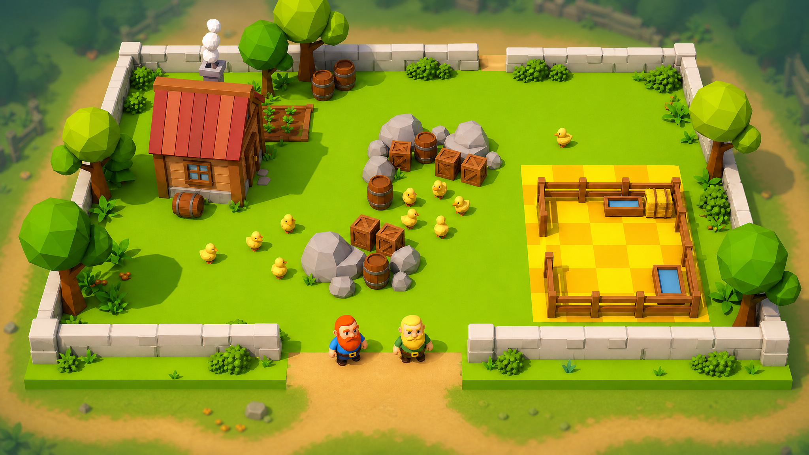
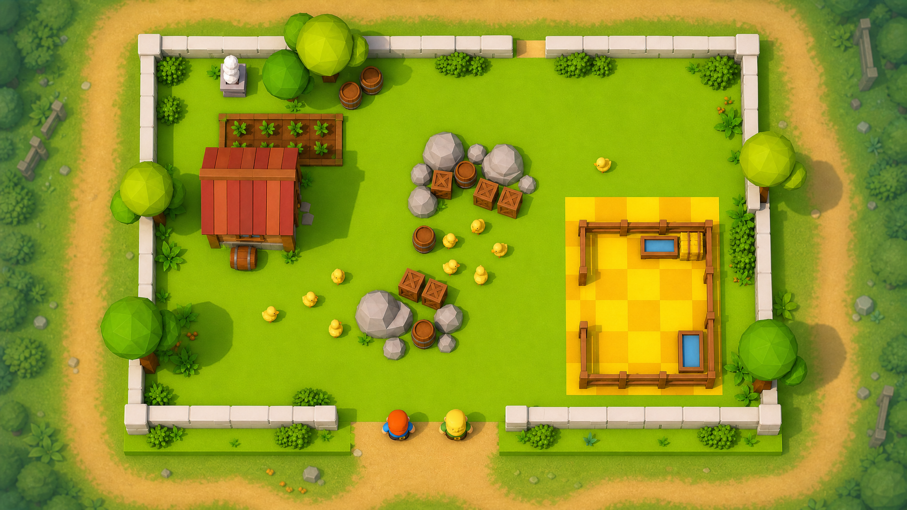

<div align="center">


# 赶鸭子上架 · Duck Duck

**1–4 人在线合作派对游戏 · 用 UrhoX / Lua 5.4 开发**
**1–4 player online co-op party game · built with UrhoX / Lua 5.4**

[]()
[]()
[]()
[]()
[]()

</div>

---

## ⚠️ 项目身份声明 / Project Identity

> **这不是一个 Python OOP 教学项目。**
> **This is NOT the Python OOP teaching project of the same name.**

GitHub 上有多个名为 `duck-duck` 的仓库，其中**最常被搜到的是一个用于演示 Python 面向对象编程的教学项目**（含 `src/duck.py` / `src/pond.py` / `data/ducks.json` / `tests/`）。

本仓库与那个 Python 项目**毫无关系**。本仓库是：

- 🎮 **一个真正可运行的 3D 派对游戏**（UrhoX 引擎，Lua 5.4 脚本）
- 🤝 **客户端-服务端架构**，支持 1–4 人联机
- 🦆 **核心玩法**：玩家扮演矮人，协作把鸭子赶进围栏（参考《羊羊集合啦》《胡闹厨房/赶鸭》）
- 📁 **代码全部在 `scripts/`，资源全部在 `assets/`**，无任何 `.py` 文件、无 `src/`、无 `tests/` 目录

**正确的仓库 URL**：`https://github.com/zhenglifan-cpu/duck-duck`

If you're looking for the Python OOP teaching project ("Duck Duck created as an educational project to demonstrate object-oriented programming concepts in Python"), **you've come to the wrong place** — please search elsewhere.

---

## 📸 截图 / Screenshots

<table>
<tr>
<td align="center"><b>透视视角 / Perspective</b><br/></td>
<td align="center"><b>俯瞰视角 / Top-down</b><br/></td>
</tr>
</table>

固定等距俯瞰视角，Low-Poly 暖色卡通风。
Fixed isometric camera, low-poly warm cartoon style.

---

## 🎯 核心玩法 / Core Gameplay

### 一句话概括

> 玩家操控矮人角色，在布满障碍的 3D 关卡中协作把鸭群赶入指定围栏（"上架"），完成阶段成就。

### 主要操作

| 操作 | 按键 | 效果 |
|---|---|---|
| 移动 | WASD / 摇杆 | 矮人移动 |
| 冲刺 | Shift / 摇杆按键 | 短时加速 (6.5 m/s) |
| 拍手驱赶 | 空格 / A键 | 发出声响惊吓 5m 内鸭子（冷却 0.8s） |
| 世界标记 | 数字键 1-4 | 在前方放置彩色临时标记（去这里/堵这里/帮我/看守） |
| 使用面包 | E | 放置面包屑吸引鸭子 |
| 地图预览 | P | 切换正交俯瞰预览 |

### 核心系统

- **Boids 鸭群 AI**：分离力 + 聚合力 + 对齐力 + 恐惧力 + 闲逛力 + 边界力 + 障碍避让 + 面包吸引
- **状态机**：idle / alert / panic / settled / crying（小鸭仔脱母时）
- **逃跑机制**：已上架鸭子在所有玩家远离 10m 后有几率自主出栏
- **连击系统**：3 秒内连续上架触发 ×2/×3/×5 倍率金币奖励
- **云端存档**：金币余额通过 `clientCloud:Add("gold", N)` 跨设备持久化

---

## 🦆 v2.2 鸭子分型 / Duck Type System

最新版本引入 5 种鸭子，每种都有独特视觉与行为：

| 类型 | 数量 | 视觉差异 | 行为差异 |
|---|---|---|---|
| **普通鸭** 🦆 | 4 | 标准白身橙嘴 | 标准 Boids |
| **头鸭** 🦆👑 | 1 | 大 1.3×、头顶金冠、脚下金圈 | 周围 5m 内鸭子跟随它的速度方向 |
| **倔鸭** 🦆⬛ | 1 | 大 1.1×、深色围巾 | **完全无视拍手**，只能用面包引诱 |
| **母鸭** 🦆🌸 | 1 | 大 1.15×、粉色花结 | 入栏时会"召唤"小鸭仔 |
| **小鸭仔** 🐤 | 3 | 缩 0.55×、鲜黄绒毛 | **必须距母鸭 ≤ 4m**，否则原地哀鸣不动 |

整局共 **9 只鸭子**，三星条件 = 全部上架（含完整家庭）。

---

## 🏗️ 项目结构 / Project Structure

```
duck-duck/
├── .project/              # UrhoX 项目配置（构建工具管理）
│   ├── project.json       # 入口、多人模式配置
│   └── settings.json
├── scripts/               # ✅ 所有 Lua 代码（资源根目录）
│   ├── main.lua           # 入口路由（IsServerMode? → Server / Client）
│   ├── config/
│   │   ├── GameConfig.lua # 全局参数（玩家速度、Boids 权重、地图布局、鸭子分型...）
│   │   └── AstroonTheme.lua
│   ├── network/
│   │   ├── Server.lua     # 服务端权威：鸭子 AI、物理、计分、连击
│   │   ├── Client.lua     # 客户端：渲染、输入、UI、HUD、结算
│   │   └── Shared.lua     # 共享：场景搭建、事件注册
│   ├── entity/
│   │   ├── DuckRenderer.lua  # 鸭子 3D 模型 + 状态/分型视觉
│   │   └── DwarfRenderer.lua # 矮人 3D 模型 + 拍手动画
│   ├── audio/
│   │   └── AudioManager.lua  # BGM + SFX
│   ├── MapEditor.lua         # 运行时障碍物编辑器
│   ├── TerrainEditor.lua     # 运行时地形（target/blocked）编辑器
│   └── MapPreviewCamera.lua  # 正交俯瞰预览相机（P 键）
├── assets/                # ✅ 所有游戏资源
│   ├── Meshes/            # 3D 模型 (.mdl)（duck/dwarf/cabin/barrel/tree...）
│   ├── Materials/         # PBR 材质 (.xml)
│   ├── Textures/          # 漫反射贴图 (.png/.xml)
│   ├── Prefabs/           # 预制体 (.prefab)
│   ├── Fonts/             # 字体 (.ttf)
│   ├── audio/             # BGM + SFX (.ogg)
│   ├── image/             # UI 图（标题、HUD 元素）
│   └── ...
└── docs/                  # 设计文档
    ├── game-design.md          # 主设计文档
    ├── level-1-sunny-farm.md   # 第 1 关详细设计
    ├── level-2-creek-farm.md   # 第 2 关草案
    └── images/                 # README 截图引用
```

---

## 🛠️ 技术栈 / Tech Stack

| 项目 | 选型 |
|---|---|
| 引擎 | **UrhoX**（基于 Urho3D 的 Web/原生统一发行平台） |
| 脚本 | **Lua 5.4** |
| 渲染 | UrhoX 内置 PBR 管线 + 程序化材质（`Shared.CreatePBRMaterial`） |
| UI | **`urhox-libs/UI`**（Yoga Flexbox + NanoVG）+ AstroonTheme 主题 |
| 物理 | UrhoX 3D 物理（碰撞检测、地形阻挡） |
| 网络 | UrhoX C/S 架构（服务端权威 + REPLICATED 节点同步） |
| 持久化 | `clientCloud` 云端存储（金币、设置） |
| 模型来源 | AI 生成的 GLB → 通过 `/import-glb` 转 `.mdl` 导入 |

---

## 🚀 运行 / How to Run

本项目是 **UrhoX Maker 平台原生项目**，不能用 `python` / `node` / `lua` 命令直接跑：

1. 在 UrhoX Maker / TapTapMaker 平台导入此仓库
2. 平台自动识别 `scripts/main.lua` 为入口
3. 选择运行模式：
   - **Server 模式**：开服务端实例
   - **Client 模式**：连接服务端，最多 4 人同时在线
4. 入口路由由 `.project/project.json` 中 `entry@client` / `entry@server` 配置

---

## 📋 路线图 / Roadmap

| 版本 | 内容 | 状态 |
|---|---|---|
| **v2.0** | 第 1 关阳光牧场、Boids AI、4 玩家联机、ping 系统、面包道具、金币云存档、运行时编辑器 | ✅ 已上线 |
| **v2.1** | 连击入栏系统（×2/×3/×5 金币倍率） | ✅ 已上线 |
| **v2.2** | 鸭子分型（头鸭/倔鸭/母鸭/小鸭仔） | ✅ 本次推送 |
| v2.3 | 群体躁动条 + Clap 习惯化 + Bread 充能制 | 📝 设计完成 |
| v2.4 | 走失漂泊 + 滚木撞击 + 末位狡猾化 | 📝 设计完成 |
| v2.5 | 完美奖 / 速通奖 / 家庭团圆奖 + 结算面板增项 | 📝 设计完成 |
| v3.0 | 关卡 2-5（溪流农场/丰收市集/泥泞雨天/鸭子之夜） | 📝 草案 |

详细设计见 [`docs/level-1-sunny-farm.md`](docs/level-1-sunny-farm.md) 与 [`docs/game-design.md`](docs/game-design.md)。

---

## 🎨 设计哲学 / Design Philosophy

> **每个机制都对应一个"取舍点"，让玩家的"输入≠输出"**
> **Every mechanic introduces a tradeoff — so player input never trivially equals output**

参考标杆：
- 《羊羊集合啦》(Sheepherds!) — 群体 AI 与无强制玩法的氛围
- 《胡闹厨房/赶鸭》(Overcooked! / Pile Up Royale) — 固定等距视角、4 人协作混乱

差异化：
- 角色从牧羊犬改为更具表现力的**矮人**（可挥手、抛物、表情更丰富）
- 引入**头鸭/倔鸭/母鸭/小鸭仔**形成策略层次
- **道具经济**（面包、围栏、扩音器）与金币商店

---

## 📜 License

待定 / TBD（如发布为开源项目，建议 MIT 或 CC BY-NC-SA 4.0）

---

<div align="center">

**Made with 🦆 by 一名 AI 游戏设计师 + Claude Opus 4.7**

如果 Maker / GitHub 任何审核员看到这里：本仓库就是**一个 1-4 人合作的 UrhoX/Lua 派对游戏**，不是 Python OOP 教学项目。请勿混淆。

</div>
